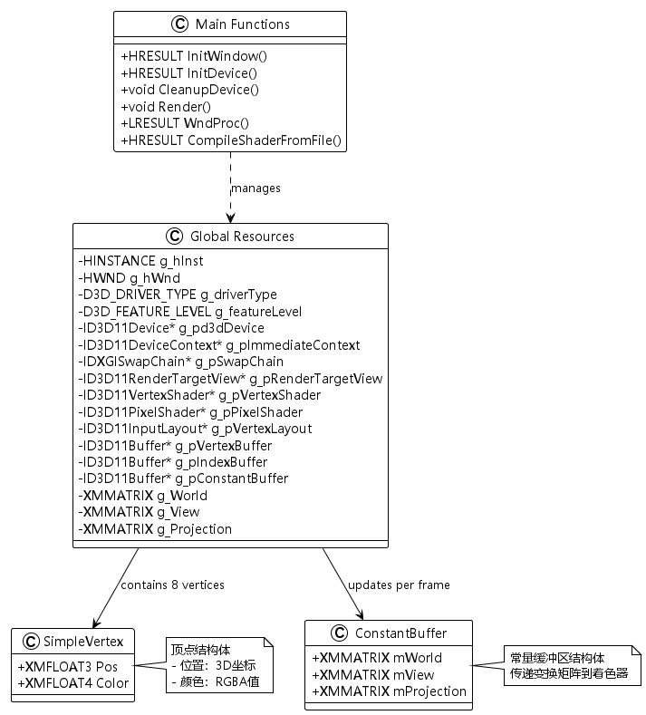
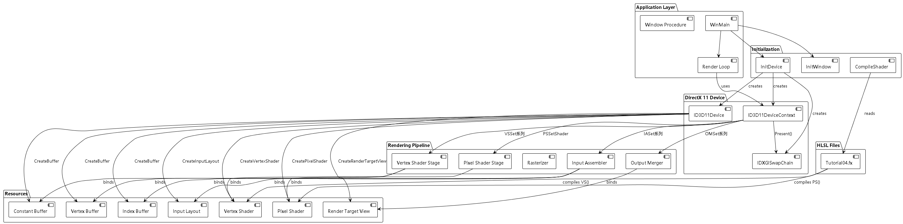
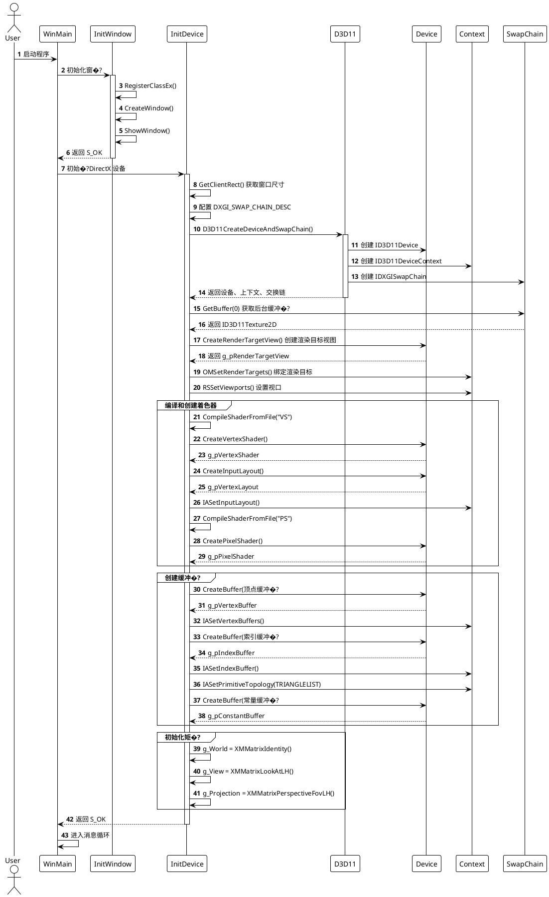
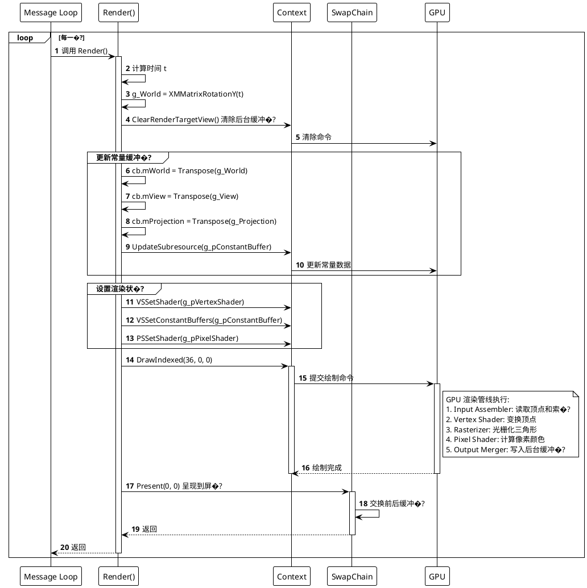
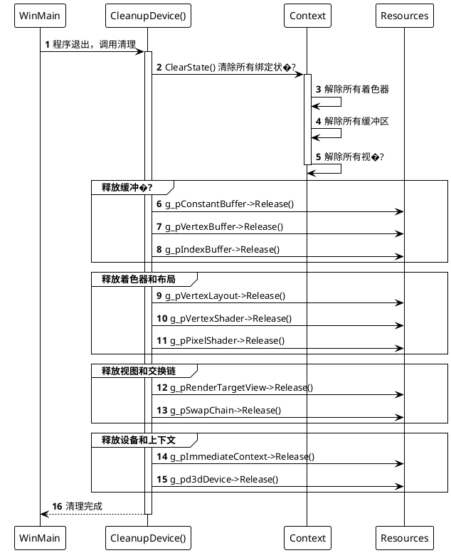
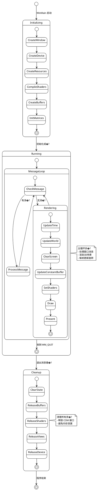

# Tutorial04 项目详细分析文档

## 📋 项目概述

**项目名称**: Tutorial04 - Direct3D 11 3D Spaces  
**功能描述**: 本项目演示如何使�?Direct3D 11 渲染一个旋转的3D立方体，涉及顶点缓冲区、索引缓冲区、着色器、常量缓冲区以及3D变换矩阵的使用�?

### 主要特�?
- 创建并渲染一个带颜色�?D立方�?
- 使用索引缓冲区优化顶点数�?
- 实现世界、视图、投影三大变换矩�?
- 立方体绕Y轴自动旋转动�?
- 顶点着色器和像素着色器的编译与使用

---

## 🔧 DirectX 11 接口详细分析

本项目使用了多个 DirectX 11 核心接口，以下是详细的接口说明和参数解析�?

### 1. D3D11CreateDeviceAndSwapChain

**功能**: 创建 Direct3D 11 设备、设备上下文和交换链

**函数签名**:
```cpp
HRESULT D3D11CreateDeviceAndSwapChain(
    IDXGIAdapter*         pAdapter,           // 视频适配器指�?
    D3D_DRIVER_TYPE       DriverType,         // 驱动类型
    HMODULE               Software,           // 软件光栅化器DLL句柄
    UINT                  Flags,              // 创建标志
    const D3D_FEATURE_LEVEL* pFeatureLevels,  // 功能级别数组
    UINT                  FeatureLevels,      // 功能级别数量
    UINT                  SDKVersion,         // SDK版本
    const DXGI_SWAP_CHAIN_DESC* pSwapChainDesc, // 交换链描�?
    IDXGISwapChain**      ppSwapChain,        // 输出交换链指�?
    ID3D11Device**        ppDevice,           // 输出设备指针
    D3D_FEATURE_LEVEL*    pFeatureLevel,      // 输出实际功能级别
    ID3D11DeviceContext** ppImmediateContext  // 输出设备上下文指�?
);
```

**项目中的使用**:
```cpp
hr = D3D11CreateDeviceAndSwapChain(
    NULL,                    // 使用默认适配�?
    g_driverType,            // 驱动类型 (HARDWARE/WARP/REFERENCE)
    NULL,                    // 不使用软件光栅化�?
    createDeviceFlags,       // Debug模式下包�?D3D11_CREATE_DEVICE_DEBUG
    featureLevels,           // 支持的功能级别数�?
    numFeatureLevels,        // 功能级别数量
    D3D11_SDK_VERSION,       // SDK版本常量
    &sd,                     // 交换链描述结�?
    &g_pSwapChain,           // 输出交换�?
    &g_pd3dDevice,           // 输出设备
    &g_featureLevel,         // 输出实际功能级别
    &g_pImmediateContext     // 输出设备上下�?
);
```

**参数详解**:
- **pAdapter**: NULL 表示使用默认适配器（主显卡）
- **DriverType**: 
  - `D3D_DRIVER_TYPE_HARDWARE`: 硬件加速（首选）
  - `D3D_DRIVER_TYPE_WARP`: 高性能软件光栅化器
  - `D3D_DRIVER_TYPE_REFERENCE`: 参考光栅化器（最慢但最准确�?
- **Flags**: 
  - `D3D11_CREATE_DEVICE_DEBUG`: 启用调试层，用于开发调�?
- **FeatureLevels**: 
  - `D3D_FEATURE_LEVEL_11_0`: Direct3D 11.0
  - `D3D_FEATURE_LEVEL_10_1`: Direct3D 10.1
  - `D3D_FEATURE_LEVEL_10_0`: Direct3D 10.0

**DXGI_SWAP_CHAIN_DESC 结构详解**:
```cpp
DXGI_SWAP_CHAIN_DESC sd;
sd.BufferCount = 1;                              // 后台缓冲区数�?
sd.BufferDesc.Width = width;                     // 缓冲区宽度（像素�?
sd.BufferDesc.Height = height;                   // 缓冲区高度（像素�?
sd.BufferDesc.Format = DXGI_FORMAT_R8G8B8A8_UNORM; // 像素格式（RGBA 8位无符号归一化）
sd.BufferDesc.RefreshRate.Numerator = 60;        // 刷新率分子（60Hz�?
sd.BufferDesc.RefreshRate.Denominator = 1;       // 刷新率分�?
sd.BufferUsage = DXGI_USAGE_RENDER_TARGET_OUTPUT; // 用作渲染目标
sd.OutputWindow = g_hWnd;                        // 输出窗口句柄
sd.SampleDesc.Count = 1;                         // 多重采样数量�?=不使用）
sd.SampleDesc.Quality = 0;                       // 多重采样质量
sd.Windowed = TRUE;                              // 窗口模式（非全屏�?
```

---

### 2. IDXGISwapChain::GetBuffer

**功能**: 获取交换链的后台缓冲区纹�?

**函数签名**:
```cpp
HRESULT GetBuffer(
    UINT         Buffer,      // 缓冲区索�?
    REFIID       riid,        // 接口ID
    void**       ppSurface    // 输出接口指针
);
```

**项目中的使用**:
```cpp
ID3D11Texture2D* pBackBuffer = NULL;
hr = g_pSwapChain->GetBuffer(
    0,                              // 第一个后台缓冲区
    __uuidof(ID3D11Texture2D),      // 请求 ID3D11Texture2D 接口
    (LPVOID*)&pBackBuffer           // 输出纹理指针
);
```

**参数详解**:
- **Buffer**: 0 表示第一个后台缓冲区（通常只有一个）
- **riid**: `__uuidof(ID3D11Texture2D)` 获取2D纹理接口
- **ppSurface**: 返回的纹理指针，需要手动释�?

---

### 3. ID3D11Device::CreateRenderTargetView

**功能**: 创建渲染目标视图，用于将渲染结果输出到纹�?

**函数签名**:
```cpp
HRESULT CreateRenderTargetView(
    ID3D11Resource*              pResource,  // 资源指针（纹理）
    const D3D11_RENDER_TARGET_VIEW_DESC* pDesc, // 视图描述
    ID3D11RenderTargetView**     ppRTView    // 输出视图指针
);
```

**项目中的使用**:
```cpp
hr = g_pd3dDevice->CreateRenderTargetView(
    pBackBuffer,           // 后台缓冲区纹�?
    NULL,                  // NULL=使用默认视图描述
    &g_pRenderTargetView   // 输出渲染目标视图
);
pBackBuffer->Release();    // 立即释放纹理引用
```

**参数详解**:
- **pResource**: 要创建视图的资源（通常是后台缓冲区�?
- **pDesc**: NULL 表示使用默认视图描述（访问整个资源）
- **ppRTView**: 返回的渲染目标视图指�?

---

### 4. ID3D11DeviceContext::OMSetRenderTargets

**功能**: 将渲染目标绑定到输出合并阶段

**函数签名**:
```cpp
void OMSetRenderTargets(
    UINT                       NumViews,        // 渲染目标数量
    ID3D11RenderTargetView*const* ppRenderTargetViews, // 渲染目标数组
    ID3D11DepthStencilView*    pDepthStencilView // 深度模板视图
);
```

**项目中的使用**:
```cpp
g_pImmediateContext->OMSetRenderTargets(
    1,                      // 绑定1个渲染目�?
    &g_pRenderTargetView,   // 渲染目标视图数组
    NULL                    // 不使用深度模板缓冲区
);
```

**参数详解**:
- **NumViews**: 绑定的渲染目标数量（最�?个）
- **ppRenderTargetViews**: 渲染目标视图指针数组
- **pDepthStencilView**: NULL 表示不使用深度测试（本项目未实现�?

---

### 5. ID3D11DeviceContext::RSSetViewports

**功能**: 设置视口参数，定义渲染区�?

**函数签名**:
```cpp
void RSSetViewports(
    UINT                NumViewports,  // 视口数量
    const D3D11_VIEWPORT* pViewports   // 视口数组
);
```

**项目中的使用**:
```cpp
D3D11_VIEWPORT vp;
vp.Width = (FLOAT)width;      // 视口宽度
vp.Height = (FLOAT)height;    // 视口高度
vp.MinDepth = 0.0f;           // 最小深度�?
vp.MaxDepth = 1.0f;           // 最大深度�?
vp.TopLeftX = 0;              // 左上角X坐标
vp.TopLeftY = 0;              // 左上角Y坐标
g_pImmediateContext->RSSetViewports(1, &vp);
```

**D3D11_VIEWPORT 结构详解**:
- **Width/Height**: 视口尺寸，通常等于窗口客户区尺�?
- **MinDepth/MaxDepth**: 深度范围，通常�?[0.0, 1.0]
- **TopLeftX/TopLeftY**: 视口左上角位置（屏幕空间坐标�?

---

### 6. D3DX11CompileFromFile

**功能**: 从文件编�?HLSL 着色器代码

**函数签名**:
```cpp
HRESULT D3DX11CompileFromFile(
    LPCWSTR              pSrcFile,       // 源文件路�?
    const D3D10_SHADER_MACRO* pDefines,  // 宏定义数�?
    LPD3D10INCLUDE       pInclude,       // 包含处理�?
    LPCSTR               pFunctionName,  // 入口函数�?
    LPCSTR               pProfile,       // 着色器配置文件
    UINT                 Flags1,         // 编译标志1
    UINT                 Flags2,         // 编译标志2
    ID3DX11ThreadPump*   pPump,          // 线程�?
    ID3D10Blob**         ppShader,       // 输出着色器字节�?
    ID3D10Blob**         ppErrorMsgs,    // 输出错误信息
    HRESULT*             pHResult        // 异步结果
);
```

**项目中的使用**:
```cpp
// 编译顶点着色器
ID3DBlob* pVSBlob = NULL;
hr = D3DX11CompileFromFile(
    L"Tutorial04.fx",           // 着色器文件�?
    NULL,                       // 不使用宏定义
    NULL,                       // 使用默认包含处理�?
    "VS",                       // 顶点着色器入口函数
    "vs_4_0",                   // Shader Model 4.0
    dwShaderFlags,              // 编译标志（Debug模式包含调试信息�?
    0,                          // 效果标志（未使用�?
    NULL,                       // 不使用异步编�?
    &pVSBlob,                   // 输出字节�?
    &pErrorBlob,                // 输出错误信息
    NULL                        // 不使用异步结�?
);

// 编译像素着色器
ID3DBlob* pPSBlob = NULL;
hr = D3DX11CompileFromFile(
    L"Tutorial04.fx",           // 着色器文件�?
    NULL, NULL,
    "PS",                       // 像素着色器入口函数
    "ps_4_0",                   // Shader Model 4.0
    dwShaderFlags, 0, NULL,
    &pPSBlob, &pErrorBlob, NULL
);
```

**参数详解**:
- **pFunctionName**: 着色器入口函数名（VS=顶点着色器，PS=像素着色器�?
- **pProfile**: 着色器模型版本
  - `vs_4_0`: Vertex Shader 4.0
  - `ps_4_0`: Pixel Shader 4.0
  - `vs_5_0`, `ps_5_0`: Shader Model 5.0（需�?D3D11�?
- **Flags1**: 编译标志
  - `D3DCOMPILE_DEBUG`: 包含调试信息
  - `D3DCOMPILE_ENABLE_STRICTNESS`: 启用严格模式

---

### 7. ID3D11Device::CreateVertexShader

**功能**: 从编译后的字节码创建顶点着色器对象

**函数签名**:
```cpp
HRESULT CreateVertexShader(
    const void*          pShaderBytecode,  // 着色器字节�?
    SIZE_T               BytecodeLength,   // 字节码长�?
    ID3D11ClassLinkage*  pClassLinkage,    // 类链接器
    ID3D11VertexShader** ppVertexShader    // 输出顶点着色器
);
```

**项目中的使用**:
```cpp
hr = g_pd3dDevice->CreateVertexShader(
    pVSBlob->GetBufferPointer(),  // 字节码数据指�?
    pVSBlob->GetBufferSize(),     // 字节码大�?
    NULL,                         // 不使用动态链�?
    &g_pVertexShader              // 输出顶点着色器对象
);
```

**参数详解**:
- **pShaderBytecode**: 编译后的二进制着色器代码
- **BytecodeLength**: 字节码的字节�?
- **pClassLinkage**: NULL（动态着色器链接，高级特性）
- **ppVertexShader**: 返回的顶点着色器对象指针

---

### 8. ID3D11Device::CreateInputLayout

**功能**: 创建输入布局，描述顶点数据的结构

**函数签名**:
```cpp
HRESULT CreateInputLayout(
    const D3D11_INPUT_ELEMENT_DESC* pInputElementDescs, // 输入元素描述数组
    UINT                    NumElements,      // 元素数量
    const void*             pShaderBytecodeWithInputSignature, // 顶点着色器字节�?
    SIZE_T                  BytecodeLength,   // 字节码长�?
    ID3D11InputLayout**     ppInputLayout     // 输出输入布局
);
```

**项目中的使用**:
```cpp
D3D11_INPUT_ELEMENT_DESC layout[] = {
    {
        "POSITION",                         // 语义名称
        0,                                  // 语义索引
        DXGI_FORMAT_R32G32B32_FLOAT,        // 数据格式�?个float�?
        0,                                  // 输入槽索�?
        0,                                  // 字节偏移�?
        D3D11_INPUT_PER_VERTEX_DATA,        // 输入分类（逐顶点）
        0                                   // 实例数据步进�?
    },
    {
        "COLOR",                            // 语义名称
        0,                                  // 语义索引
        DXGI_FORMAT_R32G32B32A32_FLOAT,     // 数据格式�?个float�?
        0,                                  // 输入槽索�?
        12,                                 // 字节偏移量（POSITION�?2字节�?
        D3D11_INPUT_PER_VERTEX_DATA,        // 输入分类
        0                                   // 实例数据步进�?
    },
};
UINT numElements = ARRAYSIZE(layout);

hr = g_pd3dDevice->CreateInputLayout(
    layout,                       // 输入元素描述数组
    numElements,                  // 元素数量�?个）
    pVSBlob->GetBufferPointer(),  // 顶点着色器字节�?
    pVSBlob->GetBufferSize(),     // 字节码大�?
    &g_pVertexLayout              // 输出输入布局对象
);
```

**D3D11_INPUT_ELEMENT_DESC 结构详解**:
- **SemanticName**: 语义名称，必须与着色器输入匹配（POSITION, COLOR, TEXCOORD等）
- **SemanticIndex**: 语义索引，用于区分多个相同语义（�?TEXCOORD0, TEXCOORD1�?
- **Format**: 数据格式
  - `DXGI_FORMAT_R32G32B32_FLOAT`: 3D 向量（位置）
  - `DXGI_FORMAT_R32G32B32A32_FLOAT`: 4D 向量（颜�?RGBA�?
  - `DXGI_FORMAT_R32G32_FLOAT`: 2D 向量（纹理坐标）
- **InputSlot**: 输入槽编号（0-15），用于多缓冲区输入
- **AlignedByteOffset**: 从顶点结构起始位置的字节偏移
- **InputSlotClass**: 
  - `D3D11_INPUT_PER_VERTEX_DATA`: 逐顶点数�?
  - `D3D11_INPUT_PER_INSTANCE_DATA`: 逐实例数据（实例化渲染）

---

### 9. ID3D11DeviceContext::IASetInputLayout

**功能**: 设置输入装配阶段的输入布局

**函数签名**:
```cpp
void IASetInputLayout(
    ID3D11InputLayout* pInputLayout  // 输入布局指针
);
```

**项目中的使用**:
```cpp
g_pImmediateContext->IASetInputLayout(g_pVertexLayout);
```

**参数详解**:
- **pInputLayout**: 要绑定的输入布局对象，NULL 表示清除当前绑定

---

### 10. ID3D11Device::CreatePixelShader

**功能**: 从编译后的字节码创建像素着色器对象

**函数签名**:
```cpp
HRESULT CreatePixelShader(
    const void*          pShaderBytecode,  // 着色器字节�?
    SIZE_T               BytecodeLength,   // 字节码长�?
    ID3D11ClassLinkage*  pClassLinkage,    // 类链接器
    ID3D11PixelShader**  ppPixelShader     // 输出像素着色器
);
```

**项目中的使用**:
```cpp
hr = g_pd3dDevice->CreatePixelShader(
    pPSBlob->GetBufferPointer(),  // 字节码数据指�?
    pPSBlob->GetBufferSize(),     // 字节码大�?
    NULL,                         // 不使用动态链�?
    &g_pPixelShader               // 输出像素着色器对象
);
```

**参数详解**: �?CreateVertexShader 相同，只是创建的是像素着色器对象

---

### 11. ID3D11Device::CreateBuffer

**功能**: 创建缓冲区资源（顶点缓冲区、索引缓冲区、常量缓冲区�?

**函数签名**:
```cpp
HRESULT CreateBuffer(
    const D3D11_BUFFER_DESC*      pDesc,        // 缓冲区描�?
    const D3D11_SUBRESOURCE_DATA* pInitialData, // 初始数据
    ID3D11Buffer**                ppBuffer      // 输出缓冲�?
);
```

#### 11.1 创建顶点缓冲�?

**项目中的使用**:
```cpp
// 定义顶点数据�?个顶点，立方体）
SimpleVertex vertices[] = {
    { XMFLOAT3(-1.0f,  1.0f, -1.0f), XMFLOAT4(0.0f, 0.0f, 1.0f, 1.0f) }, // 蓝色
    { XMFLOAT3( 1.0f,  1.0f, -1.0f), XMFLOAT4(0.0f, 1.0f, 0.0f, 1.0f) }, // 绿色
    { XMFLOAT3( 1.0f,  1.0f,  1.0f), XMFLOAT4(0.0f, 1.0f, 1.0f, 1.0f) }, // 青色
    { XMFLOAT3(-1.0f,  1.0f,  1.0f), XMFLOAT4(1.0f, 0.0f, 0.0f, 1.0f) }, // 红色
    { XMFLOAT3(-1.0f, -1.0f, -1.0f), XMFLOAT4(1.0f, 0.0f, 1.0f, 1.0f) }, // 品红
    { XMFLOAT3( 1.0f, -1.0f, -1.0f), XMFLOAT4(1.0f, 1.0f, 0.0f, 1.0f) }, // 黄色
    { XMFLOAT3( 1.0f, -1.0f,  1.0f), XMFLOAT4(1.0f, 1.0f, 1.0f, 1.0f) }, // 白色
    { XMFLOAT3(-1.0f, -1.0f,  1.0f), XMFLOAT4(0.0f, 0.0f, 0.0f, 1.0f) }, // 黑色
};

D3D11_BUFFER_DESC bd;
ZeroMemory(&bd, sizeof(bd));
bd.Usage = D3D11_USAGE_DEFAULT;           // 默认用途（GPU读写�?
bd.ByteWidth = sizeof(SimpleVertex) * 8;  // 缓冲区大小（8个顶点）
bd.BindFlags = D3D11_BIND_VERTEX_BUFFER;  // 绑定为顶点缓冲区
bd.CPUAccessFlags = 0;                    // CPU不访�?

D3D11_SUBRESOURCE_DATA InitData;
ZeroMemory(&InitData, sizeof(InitData));
InitData.pSysMem = vertices;              // 初始数据指针

hr = g_pd3dDevice->CreateBuffer(&bd, &InitData, &g_pVertexBuffer);
```

#### 11.2 创建索引缓冲�?

**项目中的使用**:
```cpp
// 定义索引数据�?6个索引，12个三角形�?
WORD indices[] = {
    3,1,0,  2,1,3,  // 顶面�?个三角形�?
    0,5,4,  1,5,0,  // 前面
    3,4,7,  0,4,3,  // 左面
    1,6,5,  2,6,1,  // 右面
    2,7,6,  3,7,2,  // 后面
    6,4,5,  7,4,6,  // 底面
};

bd.Usage = D3D11_USAGE_DEFAULT;
bd.ByteWidth = sizeof(WORD) * 36;       // 36个索�?
bd.BindFlags = D3D11_BIND_INDEX_BUFFER; // 绑定为索引缓冲区
bd.CPUAccessFlags = 0;
InitData.pSysMem = indices;

hr = g_pd3dDevice->CreateBuffer(&bd, &InitData, &g_pIndexBuffer);
```

#### 11.3 创建常量缓冲�?

**项目中的使用**:
```cpp
bd.Usage = D3D11_USAGE_DEFAULT;
bd.ByteWidth = sizeof(ConstantBuffer);    // 常量缓冲区大�?
bd.BindFlags = D3D11_BIND_CONSTANT_BUFFER; // 绑定为常量缓冲区
bd.CPUAccessFlags = 0;

hr = g_pd3dDevice->CreateBuffer(&bd, NULL, &g_pConstantBuffer); // 无初始数�?
```

**D3D11_BUFFER_DESC 结构详解**:
- **Usage**: 缓冲区用�?
  - `D3D11_USAGE_DEFAULT`: GPU 读写，CPU 无法直接访问
  - `D3D11_USAGE_IMMUTABLE`: 只读，创建后不可修改
  - `D3D11_USAGE_DYNAMIC`: GPU 读，CPU 写（频繁更新�?
  - `D3D11_USAGE_STAGING`: CPU �?GPU 之间传输数据
- **ByteWidth**: 缓冲区字节大小，必须�?6的倍数（常量缓冲区�?
- **BindFlags**: 绑定标志
  - `D3D11_BIND_VERTEX_BUFFER`: 顶点缓冲�?
  - `D3D11_BIND_INDEX_BUFFER`: 索引缓冲�?
  - `D3D11_BIND_CONSTANT_BUFFER`: 常量缓冲�?
- **CPUAccessFlags**: CPU 访问标志
  - `0`: CPU 不访�?
  - `D3D11_CPU_ACCESS_WRITE`: CPU 可写
  - `D3D11_CPU_ACCESS_READ`: CPU 可读

---

### 12. ID3D11DeviceContext::IASetVertexBuffers

**功能**: 将顶点缓冲区绑定到输入装配阶�?

**函数签名**:
```cpp
void IASetVertexBuffers(
    UINT             StartSlot,       // 起始槽索�?
    UINT             NumBuffers,      // 缓冲区数�?
    ID3D11Buffer*const* ppVertexBuffers, // 缓冲区数�?
    const UINT*      pStrides,        // 步长数组
    const UINT*      pOffsets         // 偏移数组
);
```

**项目中的使用**:
```cpp
UINT stride = sizeof(SimpleVertex);  // 顶点结构大小�?8字节�?
UINT offset = 0;                     // 起始偏移�?
g_pImmediateContext->IASetVertexBuffers(
    0,                  // 从槽0开始绑�?
    1,                  // 绑定1个缓冲区
    &g_pVertexBuffer,   // 顶点缓冲区指�?
    &stride,            // 步长（每个顶点的字节数）
    &offset             // 偏移量（从缓冲区起始位置�?
);
```

**参数详解**:
- **StartSlot**: 起始输入槽（0-15�?
- **NumBuffers**: 绑定的缓冲区数量
- **ppVertexBuffers**: 缓冲区指针数�?
- **pStrides**: 步长数组，每个值表示对应缓冲区中相邻顶点的字节�?
- **pOffsets**: 偏移数组，每个值表示从对应缓冲区起始位置的字节偏移

---

### 13. ID3D11DeviceContext::IASetIndexBuffer

**功能**: 将索引缓冲区绑定到输入装配阶�?

**函数签名**:
```cpp
void IASetIndexBuffer(
    ID3D11Buffer* pIndexBuffer,  // 索引缓冲�?
    DXGI_FORMAT   Format,        // 索引格式
    UINT          Offset         // 偏移�?
);
```

**项目中的使用**:
```cpp
g_pImmediateContext->IASetIndexBuffer(
    g_pIndexBuffer,          // 索引缓冲�?
    DXGI_FORMAT_R16_UINT,    // 16位无符号整数索引
    0                        // 起始偏移�?
);
```

**参数详解**:
- **pIndexBuffer**: 索引缓冲区指�?
- **Format**: 索引数据格式
  - `DXGI_FORMAT_R16_UINT`: 16位无符号整数�?-65535，本项目使用�?
  - `DXGI_FORMAT_R32_UINT`: 32位无符号整数（支持更多顶点）
- **Offset**: 从缓冲区起始位置的字节偏�?

---

### 14. ID3D11DeviceContext::IASetPrimitiveTopology

**功能**: 设置图元拓扑类型（如何解释顶点数据）

**函数签名**:
```cpp
void IASetPrimitiveTopology(
    D3D11_PRIMITIVE_TOPOLOGY Topology  // 图元拓扑类型
);
```

**项目中的使用**:
```cpp
g_pImmediateContext->IASetPrimitiveTopology(
    D3D11_PRIMITIVE_TOPOLOGY_TRIANGLELIST  // 三角形列�?
);
```

**常用拓扑类型**:
- `D3D11_PRIMITIVE_TOPOLOGY_POINTLIST`: 点列�?
- `D3D11_PRIMITIVE_TOPOLOGY_LINELIST`: 线列表（�?个顶点一条线�?
- `D3D11_PRIMITIVE_TOPOLOGY_LINESTRIP`: 线带（连续的线）
- `D3D11_PRIMITIVE_TOPOLOGY_TRIANGLELIST`: 三角形列表（�?个顶点一个三角形，本项目使用�?
- `D3D11_PRIMITIVE_TOPOLOGY_TRIANGLESTRIP`: 三角形带（共享顶点）

---

### 15. XNAMath 矩阵变换函数

#### 15.1 XMMatrixIdentity
**功能**: 创建单位矩阵

**项目中的使用**:
```cpp
g_World = XMMatrixIdentity();  // 世界矩阵初始化为单位矩阵
```

#### 15.2 XMMatrixLookAtLH
**功能**: 创建左手坐标系的视图矩阵

**函数签名**:
```cpp
XMMATRIX XMMatrixLookAtLH(
    FXMVECTOR EyePosition,    // 摄像机位�?
    FXMVECTOR FocusPosition,  // 观察点位�?
    FXMVECTOR UpDirection     // 向上方向
);
```

**项目中的使用**:
```cpp
XMVECTOR Eye = XMVectorSet(0.0f, 1.0f, -5.0f, 0.0f); // 摄像机在(0, 1, -5)
XMVECTOR At  = XMVectorSet(0.0f, 1.0f,  0.0f, 0.0f); // 看向(0, 1, 0)
XMVECTOR Up  = XMVectorSet(0.0f, 1.0f,  0.0f, 0.0f); // Y轴向�?
g_View = XMMatrixLookAtLH(Eye, At, Up);
```

**参数详解**:
- **EyePosition**: 摄像机在世界空间的位�?
- **FocusPosition**: 摄像机看向的目标�?
- **UpDirection**: 定义"�?的方向（通常是Y轴正方向�?

#### 15.3 XMMatrixPerspectiveFovLH
**功能**: 创建左手坐标系的透视投影矩阵

**函数签名**:
```cpp
XMMATRIX XMMatrixPerspectiveFovLH(
    float FovAngleY,    // 垂直视场角（弧度�?
    float AspectRatio,  // 宽高�?
    float NearZ,        // 近裁剪面距离
    float FarZ          // 远裁剪面距离
);
```

**项目中的使用**:
```cpp
g_Projection = XMMatrixPerspectiveFovLH(
    XM_PIDIV2,              // π/2 = 90度视场角
    width / (FLOAT)height,  // 宽高�?
    0.01f,                  // 近裁剪面�?.01单位�?
    100.0f                  // 远裁剪面�?00单位�?
);
```

**参数详解**:
- **FovAngleY**: 垂直视场角（弧度），常用值：
  - `XM_PIDIV2` = π/2 = 90�?
  - `XM_PIDIV4` = π/4 = 45�?
- **AspectRatio**: 宽度/高度，匹配窗口比�?
- **NearZ**: 近裁剪面，小于此距离的对象不渲染
- **FarZ**: 远裁剪面，大于此距离的对象不渲染

#### 15.4 XMMatrixRotationY
**功能**: 创建绕Y轴旋转的矩阵

**函数签名**:
```cpp
XMMATRIX XMMatrixRotationY(
    float Angle  // 旋转角度（弧度）
);
```

**项目中的使用**:
```cpp
g_World = XMMatrixRotationY(t);  // t为随时间变化的角�?
```

#### 15.5 XMMatrixTranspose
**功能**: 转置矩阵（行列互换）

**项目中的使用**:
```cpp
ConstantBuffer cb;
cb.mWorld = XMMatrixTranspose(g_World);
cb.mView = XMMatrixTranspose(g_View);
cb.mProjection = XMMatrixTranspose(g_Projection);
```

**为什么需要转�?*: HLSL 使用列主序存储矩阵，�?C++ XNAMath 使用行主序，需要转置才能正确传递�?

---

### 16. ID3D11DeviceContext::UpdateSubresource

**功能**: 更新缓冲区或纹理的子资源数据

**函数签名**:
```cpp
void UpdateSubresource(
    ID3D11Resource*  pDstResource,      // 目标资源
    UINT             DstSubresource,    // 子资源索�?
    const D3D11_BOX* pDstBox,           // 目标区域
    const void*      pSrcData,          // 源数据指�?
    UINT             SrcRowPitch,       // 源数据行间距
    UINT             SrcDepthPitch      // 源数据深度间�?
);
```

**项目中的使用**:
```cpp
ConstantBuffer cb;
cb.mWorld = XMMatrixTranspose(g_World);
cb.mView = XMMatrixTranspose(g_View);
cb.mProjection = XMMatrixTranspose(g_Projection);

g_pImmediateContext->UpdateSubresource(
    g_pConstantBuffer,  // 常量缓冲�?
    0,                  // 子资源索引（缓冲区只�?个）
    NULL,               // NULL=更新整个资源
    &cb,                // 源数据（ConstantBuffer结构�?
    0,                  // 行间距（缓冲区不使用�?
    0                   // 深度间距（缓冲区不使用）
);
```

**参数详解**:
- **pDstResource**: 要更新的资源（缓冲区或纹理）
- **DstSubresource**: 子资源索引，缓冲区通常�?
- **pDstBox**: NULL 表示更新整个资源，否则指定更新区�?
- **pSrcData**: 源数据指�?
- **SrcRowPitch/SrcDepthPitch**: 纹理使用，缓冲区�?

---

### 17. ID3D11DeviceContext::VSSetShader

**功能**: 设置顶点着色器到渲染管�?

**函数签名**:
```cpp
void VSSetShader(
    ID3D11VertexShader*         pVertexShader,   // 顶点着色器
    ID3D11ClassInstance*const*  ppClassInstances, // 类实例数�?
    UINT                        NumClassInstances // 类实例数�?
);
```

**项目中的使用**:
```cpp
g_pImmediateContext->VSSetShader(
    g_pVertexShader,  // 顶点着色器对象
    NULL,             // 不使用动态链�?
    0                 // 类实例数量为0
);
```

**参数详解**:
- **pVertexShader**: 要绑定的顶点着色器，NULL 表示解除绑定
- **ppClassInstances**: 动态着色器链接的类实例（高级特性）
- **NumClassInstances**: 类实例数�?

---

### 18. ID3D11DeviceContext::VSSetConstantBuffers

**功能**: 将常量缓冲区绑定到顶点着色器

**函数签名**:
```cpp
void VSSetConstantBuffers(
    UINT             StartSlot,        // 起始槽索�?
    UINT             NumBuffers,       // 缓冲区数�?
    ID3D11Buffer*const* ppConstantBuffers // 常量缓冲区数�?
);
```

**项目中的使用**:
```cpp
g_pImmediateContext->VSSetConstantBuffers(
    0,                   // 从槽0开始（对应 register(b0)�?
    1,                   // 绑定1个缓冲区
    &g_pConstantBuffer   // 常量缓冲区指�?
);
```

**参数详解**:
- **StartSlot**: 起始槽索引（0-13），对应 HLSL �?`register(b#)`
- **NumBuffers**: 绑定的缓冲区数量
- **ppConstantBuffers**: 常量缓冲区指针数�?

**HLSL 对应**:
```hlsl
cbuffer ConstantBuffer : register(b0)  // 对应 StartSlot = 0
{
    matrix World;
    matrix View;
    matrix Projection;
}
```

---

### 19. ID3D11DeviceContext::PSSetShader

**功能**: 设置像素着色器到渲染管�?

**函数签名**:
```cpp
void PSSetShader(
    ID3D11PixelShader*          pPixelShader,    // 像素着色器
    ID3D11ClassInstance*const*  ppClassInstances, // 类实例数�?
    UINT                        NumClassInstances // 类实例数�?
);
```

**项目中的使用**:
```cpp
g_pImmediateContext->PSSetShader(
    g_pPixelShader,  // 像素着色器对象
    NULL,            // 不使用动态链�?
    0                // 类实例数量为0
);
```

**参数详解**: �?VSSetShader 类似，用于像素着色器

---

### 20. ID3D11DeviceContext::ClearRenderTargetView

**功能**: 清除渲染目标视图为指定颜�?

**函数签名**:
```cpp
void ClearRenderTargetView(
    ID3D11RenderTargetView* pRenderTargetView, // 渲染目标视图
    const FLOAT             ColorRGBA[4]       // RGBA颜色数组
);
```

**项目中的使用**:
```cpp
float ClearColor[4] = { 0.0f, 0.125f, 0.3f, 1.0f }; // 深蓝色背�?
g_pImmediateContext->ClearRenderTargetView(
    g_pRenderTargetView,  // 渲染目标视图
    ClearColor            // 清除颜色（RGBA�?
);
```

**参数详解**:
- **pRenderTargetView**: 要清除的渲染目标
- **ColorRGBA**: 清除颜色数组 [Red, Green, Blue, Alpha]，范�?[0.0, 1.0]

---

### 21. ID3D11DeviceContext::DrawIndexed

**功能**: 使用索引缓冲区绘制图�?

**函数签名**:
```cpp
void DrawIndexed(
    UINT IndexCount,        // 索引数量
    UINT StartIndexLocation, // 起始索引位置
    INT  BaseVertexLocation  // 基础顶点偏移
);
```

**项目中的使用**:
```cpp
g_pImmediateContext->DrawIndexed(
    36,  // 绘制36个索引（12个三角形 × 3个顶点）
    0,   // 从索�?开�?
    0    // 顶点偏移�?
);
```

**参数详解**:
- **IndexCount**: 要绘制的索引数量
  - 三角形列表：索引�?= 三角形数 × 3
  - 本项目：12个三角形（立方体6个面，每�?个三角形�? 36个索�?
- **StartIndexLocation**: 从索引缓冲区的哪个索引开始读�?
- **BaseVertexLocation**: 加到每个索引上的顶点偏移�?

---

### 22. IDXGISwapChain::Present

**功能**: 将后台缓冲区内容呈现到屏�?

**函数签名**:
```cpp
HRESULT Present(
    UINT SyncInterval,  // 垂直同步间隔
    UINT Flags          // 呈现标志
);
```

**项目中的使用**:
```cpp
g_pSwapChain->Present(
    0,  // 立即呈现，不等待垂直同步
    0   // 无特殊标�?
);
```

**参数详解**:
- **SyncInterval**: 垂直同步间隔
  - `0`: 立即呈现（可能有撕裂�?
  - `1`: 等待1个垂直刷新周期（60Hz=16.67ms�?
  - `2-4`: 等待更多垂直刷新周期
- **Flags**: 呈现标志
  - `0`: 正常呈现
  - `DXGI_PRESENT_TEST`: 测试模式（不实际呈现�?

---

### 23. ID3D11DeviceContext::ClearState

**功能**: 清除设备上下文的所有绑定状�?

**函数签名**:
```cpp
void ClearState();
```

**项目中的使用**:
```cpp
void CleanupDevice()
{
    if (g_pImmediateContext)
        g_pImmediateContext->ClearState(); // 释放资源前清除状�?
    
    // 释放所�?COM 对象...
}
```

**作用**: 解除所有着色器、缓冲区、纹理、渲染目标等的绑定，避免资源释放冲突�?

---

## 📊 接口使用统计

| 接口类型 | 数量 | 主要用�?|
|---------|------|---------|
| 设备创建接口 | 1 | D3D11CreateDeviceAndSwapChain |
| 资源创建接口 | 5 | CreateBuffer(3�?, CreateRenderTargetView, CreateInputLayout |
| 着色器接口 | 3 | CreateVertexShader, CreatePixelShader, CompileShaderFromFile |
| 资源绑定接口 | 8 | IASet系列(4�?, VSSet系列(2�?, PSSetShader, OMSetRenderTargets |
| 渲染接口 | 3 | ClearRenderTargetView, DrawIndexed, Present |
| 数学库接�?| 5 | XMMatrix系列变换函数 |
| 其他接口 | 3 | UpdateSubresource, RSSetViewports, ClearState |

**总计**: 28个主�?DirectX 11 接口

---

## 🎨 PlantUML 图表

### 1. 类图 - 数据结构关系



**说明**: 展示了项目中的主要数据结构（SimpleVertex、ConstantBuffer）和全局资源的关系�?

[查看源文件](diagrams/01_class_diagram.puml)

---

### 2. 组件�?- DirectX 11 渲染管线



package "Rendering Pipeline" {
    [Input Assembler] as ia
    [Vertex Shader Stage] as vsstage
    [Rasterizer] as raster
    [Pixel Shader Stage] as psstage
    [Output Merger] as om
}

package "HLSL Files" {
    [Tutorial04.fx] as shader
}

main --> initwin
main --> initdev
main --> render

initdev --> device : creates
initdev --> context : creates
initdev --> swapchain : creates

device --> vb : CreateBuffer
device --> ib : CreateBuffer
device --> cb : CreateBuffer
device --> vs : CreateVertexShader
device --> ps : CreatePixelShader
device --> layout : CreateInputLayout
device --> rtv : CreateRenderTargetView

compile --> shader : reads
shader --> vs : compiles VS()
shader --> ps : compiles PS()

context --> ia : IASet系列
context --> vsstage : VSSet系列
context --> psstage : PSSetShader
context --> om : OMSet系列

ia --> vb : binds
ia --> ib : binds
ia --> layout : binds

vsstage --> vs : binds
vsstage --> cb : binds

psstage --> ps : binds

om --> rtv : binds

render --> context : uses
context --> swapchain : Present()

@enduml
```

### 3. 架构�?- 系统分层结构

```plantuml
@startuml Tutorial04_Architecture
!theme plain

rectangle "应用程序�? as app {
    rectangle "Windows 消息循环" as msgloop
    rectangle "渲染主循�? as renderloop
}

rectangle "初始化层" as init {
    rectangle "窗口初始�? as wininit
    rectangle "设备初始�? as devinit
    rectangle "资源创建" as rescreate
}

rectangle "DirectX 11 API �? as dx11 {
    rectangle "设备管理" as devmgmt {
        rectangle "ID3D11Device" as dev
        rectangle "ID3D11DeviceContext" as ctx
    }
    
    rectangle "资源管理" as resmgmt {
        rectangle "缓冲�? as buffers
        rectangle "着色器" as shaders
        rectangle "视图" as views
    }
    
    rectangle "渲染管线" as pipeline {
        rectangle "IA阶段" as ia
        rectangle "VS阶段" as vs
        rectangle "Rasterizer" as rs
        rectangle "PS阶段" as ps
        rectangle "OM阶段" as om
    }
}

rectangle "DXGI �? as dxgi {
    rectangle "IDXGISwapChain" as sc
    rectangle "后台缓冲�? as bb
}

rectangle "GPU 硬件" as gpu {
    rectangle "图形处理单元" as gp
    rectangle "显存" as vram
}

app --> init : 调用初始�?
init --> dx11 : 创建设备和资�?
dx11 --> dxgi : 管理交换�?
dxgi --> gpu : 驱动调用
renderloop --> ctx : 每帧渲染命令
ctx --> pipeline : 执行渲染管线
pipeline --> gpu : 提交绘制命令
sc --> bb : 交换缓冲�?

@enduml
```

### 4. 部署�?- 文件组织结构

```plantuml
@startuml Tutorial04_Deployment
!theme plain

node "Tutorial04 项目" {
    artifact "Tutorial04.cpp" as cpp {
        + 主程序代�?
        + DirectX 初始�?
        + 渲染循环
    }
    
    artifact "Tutorial04.fx" as fx {
        + HLSL 着色器代码
        + VS() 顶点着色器
        + PS() 像素着色器
    }
    
    artifact "resource.h" as rh {
        + 资源定义
    }
    
    artifact "Tutorial04.rc" as rc {
        + 资源脚本
    }
    
    folder "DXUT" as dxut {
        artifact "DXUT 辅助�?
    }
}

node "编译产物" {
    artifact "Tutorial04.exe" as exe {
        + 可执行程�?
    }
    
    artifact "编译后的着色器" as cso {
        + VS字节�?
        + PS字节�?
    }
}

node "运行时依�? {
    artifact "d3d11.dll" as d3d11
    artifact "dxgi.dll" as dxgidll
    artifact "d3dcompiler.dll" as d3dcomp
}

cpp --> exe : 编译
fx --> cso : 编译
exe --> d3d11 : 链接
exe --> dxgidll : 链接
exe --> d3dcomp : 运行时加�?

@enduml
```

### 5. 对象�?- 运行时对象关�?

```plantuml
@startuml Tutorial04_ObjectDiagram
!theme plain

object "g_pd3dDevice" as device {
    type = ID3D11Device*
    功能 = 创建资源
}

object "g_pImmediateContext" as context {
    type = ID3D11DeviceContext*
    功能 = 执行渲染命令
}

object "g_pSwapChain" as swapchain {
    type = IDXGISwapChain*
    BufferCount = 1
    Format = DXGI_FORMAT_R8G8B8A8_UNORM
}

object "g_pVertexBuffer" as vb {
    type = ID3D11Buffer*
    Usage = D3D11_USAGE_DEFAULT
    ByteWidth = 224 (8顶点×28字节)
    BindFlags = D3D11_BIND_VERTEX_BUFFER
}

object "g_pIndexBuffer" as ib {
    type = ID3D11Buffer*
    ByteWidth = 72 (36索引×2字节)
    BindFlags = D3D11_BIND_INDEX_BUFFER
}

object "g_pConstantBuffer" as cb {
    type = ID3D11Buffer*
    ByteWidth = 192 (3�?x4矩阵)
    BindFlags = D3D11_BIND_CONSTANT_BUFFER
}

object "g_pVertexShader" as vs {
    type = ID3D11VertexShader*
    EntryPoint = "VS"
    Profile = "vs_4_0"
}

object "g_pPixelShader" as ps {
    type = ID3D11PixelShader*
    EntryPoint = "PS"
    Profile = "ps_4_0"
}

object "g_pRenderTargetView" as rtv {
    type = ID3D11RenderTargetView*
    Resource = BackBuffer
}

device --> vb : CreateBuffer()
device --> ib : CreateBuffer()
device --> cb : CreateBuffer()
device --> vs : CreateVertexShader()
device --> ps : CreatePixelShader()
device --> rtv : CreateRenderTargetView()
swapchain --> rtv : GetBuffer()
context ..> vb : IASetVertexBuffers()
context ..> ib : IASetIndexBuffer()
context ..> cb : VSSetConstantBuffers()
context ..> vs : VSSetShader()
context ..> ps : PSSetShader()
context ..> rtv : OMSetRenderTargets()

@enduml
```



---

### 6. 序列�?- 初始化流�?



### 7. 序列�?- 渲染流程



### 8. 序列�?- 清理流程



### 9. 活动�?- 渲染管线流程

```plantuml
@startuml Tutorial04_PipelineActivity
!theme plain

start

:更新时间变量 t;

:计算世界矩阵
g_World = RotationY(t);

:清除渲染目标
ClearRenderTargetView();

partition "更新常量缓冲�? {
    :转置矩阵
    cb.mWorld = Transpose(g_World)
    cb.mView = Transpose(g_View)
    cb.mProjection = Transpose(g_Projection);
    
    :上传�?GPU
    UpdateSubresource();
}

partition "设置渲染管线" {
    :绑定顶点着色器
    VSSetShader();
    
    :绑定常量缓冲区到 VS
    VSSetConstantBuffers();
    
    :绑定像素着色器
    PSSetShader();
}

partition "GPU 渲染管线" {
    :Input Assembler
    读取顶点和索引数�?
    
    :Vertex Shader
    应用 World * View * Projection 变换;
    
    :Rasterizer
    三角形光栅化，生成像素片�?
    
    :Pixel Shader
    输出顶点颜色;
    
    :Output Merger
    写入后台缓冲�?
}

:交换前后缓冲�?
Present();

:显示到屏�?

stop

@enduml
```

### 10. 状态图 - 应用程序生命周期



---

## 📝 代码结构分析

### 数据结构

#### SimpleVertex 结构�?
```cpp
struct SimpleVertex
{
    XMFLOAT3 Pos;    // 位置�?个float (x, y, z)
    XMFLOAT4 Color;  // 颜色�?个float (r, g, b, a)
};
// 总大小：28字节 (12 + 16)
```

**用�?*: 
- 定义每个顶点的数据格�?
- 必须�?HLSL 着色器的输入签名匹�?
- 必须�?`D3D11_INPUT_ELEMENT_DESC` 布局描述匹配

#### ConstantBuffer 结构�?
```cpp
struct ConstantBuffer
{
    XMMATRIX mWorld;       // 世界变换矩阵 (4x4 = 16 float)
    XMMATRIX mView;        // 视图变换矩阵 (4x4 = 16 float)
    XMMATRIX mProjection;  // 投影变换矩阵 (4x4 = 16 float)
};
// 总大小：192字节 (64 + 64 + 64)
```

**用�?*:
- 存储变换矩阵
- 每帧更新并传递给顶点着色器
- 必须16字节对齐（DirectX 要求�?

### 渲染管线流程

```
1. 应用程序 CPU �?
   ├─ 更新世界矩阵（旋转动画）
   ├─ 转置矩阵（行主序 �?列主序）
   └─ 上传常量缓冲区到 GPU

2. Input Assembler (IA)
   ├─ 读取顶点缓冲区（8个顶点）
   ├─ 读取索引缓冲区（36个索引）
   └─ 组装图元�?2个三角形�?

3. Vertex Shader (VS)
   ├─ 接收顶点位置和颜�?
   ├─ 应用 MVP 变换：Pos = Pos × World × View × Projection
   └─ 输出屏幕空间坐标和颜�?

4. Rasterizer (RS)
   ├─ 裁剪不可见三角形
   ├─ 三角形光栅化为像素片�?
   └─ 插值顶点属性（颜色�?

5. Pixel Shader (PS)
   ├─ 接收插值后的颜�?
   └─ 直接输出颜色（无光照计算�?

6. Output Merger (OM)
   ├─ 写入渲染目标视图（后台缓冲区�?
   └─ 无深度测试（本项目未实现�?

7. 呈现
   └─ Present() 交换前后缓冲区，显示到屏�?
```

---

## 🔍 着色器代码分析

### HLSL 着色器文件 (Tutorial04.fx)

#### 常量缓冲区定�?
```hlsl
cbuffer ConstantBuffer : register(b0)
{
    matrix World;       // 对应 C++ �?cb.mWorld
    matrix View;        // 对应 C++ �?cb.mView
    matrix Projection;  // 对应 C++ �?cb.mProjection
}
```

**关键�?*:
- `register(b0)`: 绑定到常量缓冲区�?0
- HLSL 使用列主序矩阵，需要在 C++ 端转�?
- 矩阵乘法顺序：`Pos × World × View × Projection`

#### 顶点着色器输出结构
```hlsl
struct VS_OUTPUT
{
    float4 Pos : SV_POSITION;   // 系统语义：屏幕空间位�?
    float4 Color : COLOR0;      // 用户定义语义：颜�?
};
```

#### 顶点着色器 (VS)
```hlsl
VS_OUTPUT VS(float4 Pos : POSITION, float4 Color : COLOR)
{
    VS_OUTPUT output = (VS_OUTPUT)0;
    
    // MVP 变换
    output.Pos = mul(Pos, World);
    output.Pos = mul(output.Pos, View);
    output.Pos = mul(output.Pos, Projection);
    
    // 直接传递颜�?
    output.Color = Color;
    
    return output;
}
```

**变换流程**:
1. **World**: 物体空间 �?世界空间（旋转立方体�?
2. **View**: 世界空间 �?观察空间（摄像机变换�?
3. **Projection**: 观察空间 �?裁剪空间（透视投影�?
4. **自动透视除法**: 裁剪空间 �?屏幕空间（GPU 硬件执行�?

#### 像素着色器 (PS)
```hlsl
float4 PS(VS_OUTPUT input) : SV_Target
{
    return input.Color;  // 直接输出插值后的颜�?
}
```

**说明**:
- `SV_Target`: 输出到渲染目标（后台缓冲区）
- 本项目无光照计算，只显示顶点颜色
- 颜色在光栅化阶段自动插�?

---

## 📐 3D 变换数学详解

### 变换矩阵层次

```
Local Space (物体空间)
    �?World Matrix (世界矩阵)
World Space (世界空间)
    �?View Matrix (视图矩阵)
View Space (观察空间)
    �?Projection Matrix (投影矩阵)
Clip Space (裁剪空间)
    �?Perspective Division (透视除法)
NDC Space (归一化设备坐�?
    �?Viewport Transform (视口变换)
Screen Space (屏幕空间)
```

### 本项目的具体变换

#### 1. 世界矩阵 (World Matrix)
```cpp
g_World = XMMatrixRotationY(t);  // �?Y 轴旋�?t 弧度
```

**作用**: 让立方体�?Y 轴旋转，产生动画效果

#### 2. 视图矩阵 (View Matrix)
```cpp
XMVECTOR Eye = XMVectorSet(0.0f, 1.0f, -5.0f, 0.0f);  // 摄像机位�?
XMVECTOR At  = XMVectorSet(0.0f, 1.0f,  0.0f, 0.0f);  // 观察�?
XMVECTOR Up  = XMVectorSet(0.0f, 1.0f,  0.0f, 0.0f);  // 向上方向
g_View = XMMatrixLookAtLH(Eye, At, Up);
```

**摄像机设�?*:
- 位置�?0, 1, -5) - 在立方体后方5个单位，稍微往�?
- 看向�?0, 1, 0) - 立方体中心略上方
- 向上�?0, 1, 0) - Y 轴正方向

#### 3. 投影矩阵 (Projection Matrix)
```cpp
g_Projection = XMMatrixPerspectiveFovLH(
    XM_PIDIV2,              // 90度视场角
    width / (FLOAT)height,  // 宽高�?
    0.01f,                  // 近裁剪面
    100.0f                  // 远裁剪面
);
```

**投影参数**:
- **FOV**: 90度（较广的视角）
- **近平�?*: 0.01 单位（太近的对象被裁剪）
- **远平�?*: 100 单位（太远的对象被裁剪）
- **宽高�?*: 保持画面不变�?

### 矩阵转置的必要�?

```cpp
cb.mWorld = XMMatrixTranspose(g_World);
cb.mView = XMMatrixTranspose(g_View);
cb.mProjection = XMMatrixTranspose(g_Projection);
```

**原因**:
- **C++ XNAMath**: 行主�?(Row-Major) 存储矩阵
- **HLSL**: 列主�?(Column-Major) 存储矩阵
- **转置**: 将行主序转换为列主序，确保矩阵乘法正�?

---

## 🎯 立方体几何数�?

### 顶点数据�?个顶点）

```
顶点索引布局�?
       3 ----------- 2
      /|            /|
     / |           / |
    7 ----------- 6  |
    |  0 ---------|--1
    | /           | /
    |/            |/
    4 ----------- 5

顶点坐标和颜色：
0: (-1,  1, -1)  蓝色   (0, 0, 1, 1)
1: ( 1,  1, -1)  绿色   (0, 1, 0, 1)
2: ( 1,  1,  1)  青色   (0, 1, 1, 1)
3: (-1,  1,  1)  红色   (1, 0, 0, 1)
4: (-1, -1, -1)  品红   (1, 0, 1, 1)
5: ( 1, -1, -1)  黄色   (1, 1, 0, 1)
6: ( 1, -1,  1)  白色   (1, 1, 1, 1)
7: (-1, -1,  1)  黑色   (0, 0, 0, 1)
```

### 索引数据�?6个索引，12个三角形�?

```cpp
// 每个�?个三角形，每个三角形3个顶�?
顶面 (y=1):   3,1,0 �?2,1,3
前面 (z=-1):  0,5,4 �?1,5,0
左面 (x=-1):  3,4,7 �?0,4,3
右面 (x=1):   1,6,5 �?2,6,1
后面 (z=1):   2,7,6 �?3,7,2
底面 (y=-1):  6,4,5 �?7,4,6
```

**索引缓冲区优�?*:
- 只需 8 个顶点（而非 36 个重复顶点）
- 节省内存�?×28 = 224 字节（vs 36×28 = 1008 字节�?
- 节省带宽：减少顶点着色器的重复计�?

---

## 🚀 关键技术点总结

### 1. 设备创建与资源管�?
- �?使用 `D3D11CreateDeviceAndSwapChain` 一次性创建设备、上下文和交换链
- �?优先尝试硬件加速，失败则回退�?WARP 或参考设�?
- �?Debug 模式下启用调试层，便于开发调�?

### 2. 缓冲区使用模�?
| 缓冲区类�?| Usage | BindFlags | CPUAccessFlags | 更新方式 |
|-----------|-------|-----------|----------------|---------|
| 顶点缓冲�?| DEFAULT | VERTEX_BUFFER | 0 | 初始化时写入 |
| 索引缓冲�?| DEFAULT | INDEX_BUFFER | 0 | 初始化时写入 |
| 常量缓冲�?| DEFAULT | CONSTANT_BUFFER | 0 | UpdateSubresource |

### 3. 渲染管线绑定顺序
```cpp
// 1. 输入装配阶段
IASetInputLayout()         // 设置顶点布局
IASetVertexBuffers()       // 绑定顶点缓冲�?
IASetIndexBuffer()         // 绑定索引缓冲�?
IASetPrimitiveTopology()   // 设置图元类型

// 2. 着色器阶段
VSSetShader()              // 绑定顶点着色器
VSSetConstantBuffers()     // 绑定常量缓冲区到VS
PSSetShader()              // 绑定像素着色器

// 3. 输出合并阶段
OMSetRenderTargets()       // 绑定渲染目标

// 4. 光栅化阶�?
RSSetViewports()           // 设置视口
```

### 4. 每帧渲染流程
```cpp
1. UpdateSubresource()         // 更新常量缓冲区（世界矩阵变化�?
2. ClearRenderTargetView()     // 清除后台缓冲�?
3. VSSetShader()               // 设置顶点着色器
4. VSSetConstantBuffers()      // 绑定常量缓冲�?
5. PSSetShader()               // 设置像素着色器
6. DrawIndexed()               // 提交绘制命令
7. Present()                   // 呈现到屏�?
```

---

## 💡 学习要点与建�?

### 初学者重点关�?

#### 1. DirectX 11 基本概念
- **设备 (Device)**: 用于创建资源（缓冲区、纹理、着色器�?
- **设备上下�?(Context)**: 用于执行渲染命令
- **交换�?(SwapChain)**: 管理前后缓冲区交�?
- **缓冲�?(Buffer)**: 存储顶点、索引、常量数�?
- **视图 (View)**: 资源的访问接口（RenderTargetView�?

#### 2. 渲染管线阶段
```
IA �?VS �?Rasterizer �?PS �?OM
 �?   �?                 �?   �?
 |    |__________________|    |
 顶点数据    常量缓冲�?     渲染目标
```

#### 3. 坐标变换理解
- **局部空�?*: 模型自身的坐标系
- **世界空间**: 场景的统一坐标�?
- **观察空间**: 以摄像机为原点的坐标�?
- **裁剪空间**: 透视投影后的坐标�?
- **屏幕空间**: 最终的像素坐标

### 常见问题与解�?

#### 问题1: 屏幕一片黑�?
**可能原因**:
- 着色器编译失败（检�?`.fx` 文件路径�?
- 摄像机位置不对（立方体不在视野内�?
- 深度测试问题（本项目未启用深度缓冲区�?

#### 问题2: 立方体不旋转
**可能原因**:
- `UpdateSubresource()` 未调�?
- 世界矩阵未更�?
- 常量缓冲区未正确绑定到顶点着色器

#### 问题3: 内存泄漏
**解决方案**:
- 所�?COM 接口创建后必�?`Release()`
- 使用 `ClearState()` 清除绑定
- 遵循"谁创建谁释放"原则

### 扩展学习方向

#### 下一步学习内�?
1. **深度缓冲�?*: 启用深度测试，正确处理遮挡关�?
2. **纹理映射**: 为立方体添加纹理
3. **光照模型**: 实现 Phong 光照�?PBR
4. **用户交互**: 添加鼠标/键盘控制摄像�?
5. **多对象渲�?*: 渲染多个立方�?

#### 建议实践项目
- [ ] 修改顶点颜色，创建彩虹立方体
- [ ] 调整摄像机位置和视角
- [ ] 修改旋转轴（�?X �?Z 轴旋转）
- [ ] 添加缩放和平移变�?
- [ ] 创建多个立方体的场景

---

## 📚 接口快速参考表

### 设备和上下文接口

| 接口方法 | 功能 | 调用时机 |
|---------|------|---------|
| `D3D11CreateDeviceAndSwapChain` | 创建设备、上下文、交换链 | 初始�?|
| `ID3D11Device::CreateBuffer` | 创建缓冲�?| 初始�?|
| `ID3D11Device::CreateVertexShader` | 创建顶点着色器 | 初始�?|
| `ID3D11Device::CreatePixelShader` | 创建像素着色器 | 初始�?|
| `ID3D11Device::CreateInputLayout` | 创建输入布局 | 初始�?|
| `ID3D11Device::CreateRenderTargetView` | 创建渲染目标视图 | 初始�?|

### 渲染设置接口

| 接口方法 | 功能 | 参数要点 |
|---------|------|---------|
| `IASetInputLayout` | 设置输入布局 | 顶点结构描述 |
| `IASetVertexBuffers` | 绑定顶点缓冲�?| stride, offset |
| `IASetIndexBuffer` | 绑定索引缓冲�?| 格式(R16/R32) |
| `IASetPrimitiveTopology` | 设置图元类型 | TRIANGLELIST |
| `VSSetShader` | 设置顶点着色器 | NULL 为解�?|
| `VSSetConstantBuffers` | 绑定常量缓冲区到VS | 槽索�?|
| `PSSetShader` | 设置像素着色器 | NULL 为解�?|
| `OMSetRenderTargets` | 设置渲染目标 | 最�?�?|
| `RSSetViewports` | 设置视口 | 屏幕区域 |

### 绘制和呈现接�?

| 接口方法 | 功能 | 参数说明 |
|---------|------|---------|
| `ClearRenderTargetView` | 清除渲染目标 | RGBA 颜色 |
| `UpdateSubresource` | 更新缓冲区数�?| 常用于常量缓冲区 |
| `DrawIndexed` | 索引绘制 | 索引�? 起始索引, 顶点偏移 |
| `Present` | 呈现到屏�?| 垂直同步间隔 |
| `ClearState` | 清除所有绑�?| 释放资源前调�?|

### XNAMath 数学�?

| 函数 | 功能 | 返回�?|
|------|------|-------|
| `XMMatrixIdentity` | 单位矩阵 | XMMATRIX |
| `XMMatrixRotationY` | 绕Y轴旋�?| XMMATRIX |
| `XMMatrixLookAtLH` | 创建视图矩阵 | XMMATRIX |
| `XMMatrixPerspectiveFovLH` | 创建投影矩阵 | XMMATRIX |
| `XMMatrixTranspose` | 矩阵转置 | XMMATRIX |
| `XMVectorSet` | 创建向量 | XMVECTOR |

---

## 🔗 相关资源

### 官方文档
- [Microsoft DirectX 11 文档](https://docs.microsoft.com/en-us/windows/win32/direct3d11/atoc-dx-graphics-direct3d-11)
- [HLSL 语言参考](https://docs.microsoft.com/en-us/windows/win32/direct3dhlsl/dx-graphics-hlsl)
- [DirectXMath 数学库](https://docs.microsoft.com/en-us/windows/win32/dxmath/ovw-xnamath-reference)

### 学习资源
- DirectX 11 官方教程系列
- RasterTek DirectX 11 教程
- Frank Luna 的《Introduction to 3D Game Programming with DirectX 11�?

---

## 📊 项目统计信息

### 代码规模
- **主程�?*: Tutorial04.cpp (~600 �?
- **着色器**: Tutorial04.fx (~40 �?
- **数据结构**: 2 个结构体
- **DirectX 接口**: 28 个主要接�?
- **函数**: 6 个核心函�?

### 资源使用
- **顶点�?*: 8 �?
- **三角形数**: 12 �?
- **索引�?*: 36 �?
- **缓冲�?*: 3 个（顶点、索引、常量）
- **着色器**: 2 个（VS、PS�?
- **纹理**: 0 个（未使用）

### 性能特征
- **绘制调用**: 1 �?�?
- **缓冲区更�?*: 1 �?帧（常量缓冲区）
- **顶点处理**: 8 个顶�?�?
- **像素处理**: 取决于窗口大小和遮挡

---

## �?总结

### 本项目学到的内容

1. **DirectX 11 初始化流�?*
   - 创建设备和交换链
   - 配置渲染目标和视�?
   - 编译和创建着色器
   - 创建各类缓冲�?

2. **3D 渲染基础**
   - 顶点和索引缓冲区的使�?
   - MVP 矩阵变换
   - 渲染管线的配置和执行
   - 前后缓冲区交�?

3. **HLSL 着色器编程**
   - 常量缓冲区的定义和使�?
   - 顶点着色器的变换计�?
   - 像素着色器的颜色输�?

4. **DirectX 11 接口掌握**
   - 28 个核心接口的详细参数
   - 接口调用的正确顺�?
   - 资源的创建、绑定和释放

### �?Tutorial03 的区�?

| 特�?| Tutorial03 | Tutorial04 |
|-----|-----------|-----------|
| 几何�?| 三角�?| 立方�?|
| 顶点�?| 3 | 8 |
| 索引缓冲�?| �?| 有（36个索引）|
| 常量缓冲�?| �?| 有（MVP矩阵）|
| 变换 | �?| 3D 变换 |
| 动画 | �?| 旋转动画 |
| 3D 空间 | �?| �?|

### 下一步学习方�?

本项目是学习 DirectX 11 的重要里程碑，掌握了 3D 渲染的基础。建议继续学习：

1. **Tutorial05**: 深度缓冲区和深度测试
2. **Tutorial06**: 纹理映射
3. **Tutorial07**: 光照模型（环境光、漫反射、镜面反射）

---

**文档生成时间**: 2025�?1�?8�? 
**DirectX 版本**: DirectX 11  
**Shader Model**: 4.0  
**目标平台**: Windows 7+

---

*本文档详细分析了 Tutorial04 项目的所�?DirectX 11 接口调用，并提供了完整的 PlantUML 图表。适合 DirectX 11 初学者系统学习和参考�?

